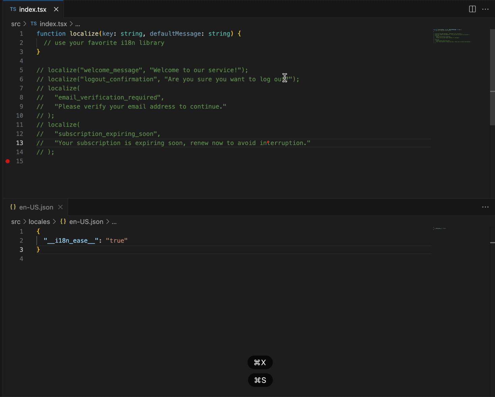
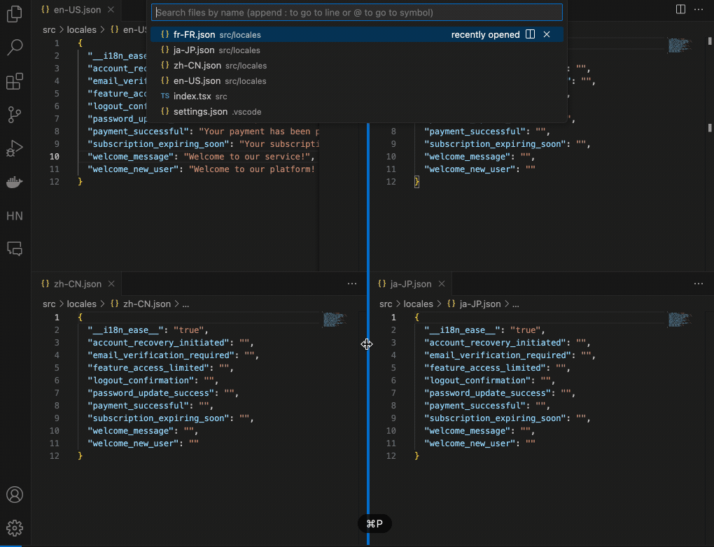

# [i18nEase](https://i18nease.hamsterbase.com/)

Please note that i18nEase is a **commercial product** and not open source. This repository is only used to collect feedback and suggestions.

You can search for i18nease in the VS Code extension marketplace and download it. The store address is [here](https://marketplace.visualstudio.com/items?itemName=hamsterbase.i18nease). i18nEase supports unlimited free trial. The first time you run it, activation is required, which you can choose to do for free. Once activated, as long as the current window is not closed, it will remain active.

<table>
	<tr>
		<th width="50%">
			Dynamic Updates
		</th>
		<th width="50%">
	    GPT translate
		</th>
	</tr>
	<tr>
		<td>
			
		</td>
		<td>
			
		</td>
	</tr>
</table>

## How to use i18nease

After installing the plugin, run the `i18nease: Generate locale config` command, and it will automatically parse your source code and generate the localize config.

## Why should I use i18nease?

There are many common i18n solutions available at present, and most of them are implemented through `t('key')` or `$t('key')`. i18nease will recognize these functions and generate the corresponding translation files.

For instance, if you write `t('key')`, then i18nease will create a corresponding translation file for each language, such as `en-US.json`, `zh-CN.json`.

```json
{
  "key": ""
}
```

You can also directly write the default value for the `key` in the code, and then you can write your own `localize` function, for example, `localize('key', "defaultMessage")`. i18nease will recognize this function and generate the corresponding translation files.

```js
function localize(key, defaultMessage) {
  return t(key);
}

localize("key", "default message");
```

Currently, i18nease recognizes the following translation functions.

1. localize('key', 'default message")
2. t('key')
3. $t('key')
